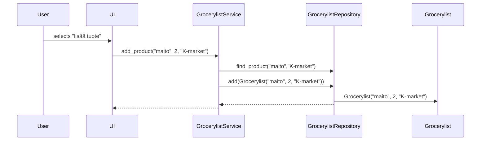

## Alustava luokka-/pakkauskaavio

## Sekvenssikaavio
### Tuotteen lisääminen
  

Toiminnallisuus alkaa käyttöliittymmässä, kun käyttäjä valitsee "lisää tuote" vaihtoehdon. Tämän jälkeen käyttäjä syöttää kaupan, tuotteen ja mahdollisen määrän. Käyttöliittymä kutsuu tämän jälkeen sovelluslogiikan *add_product* -metodia ja välittää annetut tiedot. Seuraavaksi sovelluslogiikka tarkastaa  *find_product* -metodilla onko ko.tuote jo ko.kaupan listassa. Mikäli näin ei ole (kuten tässä), niin sovelluslogiikka kutsuu seuraavaksi metodia *add(Grocerylist("maito", 2, "K-market"))*, joka lisää *Grocerylist("maito", 2, "K-market")*-olion tietokantaan. Tämä jälkeen kontrolli palaa takaisin käyttöliittymään.
