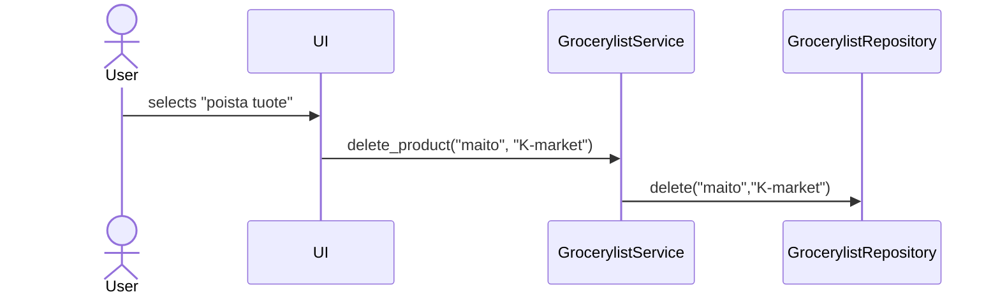

# Arkkitehtuurikuvaus

## Rakenne:
Koodin rakenne on kolmen tason kerrosarkkitehtuuri. Rakenteessa *ui* vastaa käyttöliittymästä, *services* vastaa sovelluslogiikasta ja *repositories* vastaa tietojen tallennuksesta. *entities* sisältää luokan, jonka perusteella sovelluksen käyttämät oliot on muodostettu. Pakkausrakennetta voidaan havainnollistaa seuraavasti:


## Käyttöliittymä:
Sovelluksen käyttöliittymä on tekstikäyttöliittymä. Käyttöliittymä on eristetty sovelluslogiikasta - kaikki tulostaminen ja käyttäjän kanssa kommunikointi tapahtuu ainoastaan käyttöliittymässä (*ui*). Käyttöliittymästä kutsutaan sovelluslogiikan, eli GrocerylistService-luokan, metodeja.

## Sovelluslogiikka:
Sovelluksen tietorakenne pohjautuu luokan [Grocerylist](https://github.com/ounisk/ot_harjoitustyo/blob/master/src/entities/grocerylist_entity.py) käyttöön. Se muodostaa olion, joka kuvastaa yksittäistä ostoslistan riviä, jonka attribuutteja ovat tuote, määrä ja kauppa. Sovelluslogiikka sekä tietojen tallennus, luku ja haku hyödyntävät Grocerylist-luokkaa.

```mermaid
classDiagram
  class Grocerylist{
  +str product
  +int quantity
  +str store
  }
  ```
Sovelluksen toiminnallisuuksista ja sovelluslogiikasta vastaa [GrocerylistService-luokka](https://github.com/ounisk/ot_harjoitustyo/blob/master/src/services/grocerylist_service.py) ja sen ainoa olio. GrocerylistService-luokka tarjoaa metodit, joilla käyttöliittymän toiminnallisuudet toteutetaan. GrocerylistService-luokan metodeja ovat:

- `add_product(product, quantity, store)`

- `delete_product(product, store)`

- `modify_quantity(product, quantity, store)`

- `empty_whole_list()`

- `get_products()`

-  `get_products_store()`

-  `get_top3_products()`


Lisäksi GrocerylistService-luokalla on pääsy ostolistan tietojen tallennuksesta, lukemista ja hausta vastaavan [GrocerylistRepository-luokan](https://github.com/ounisk/ot_harjoitustyo/blob/master/src/repositories/grocerylist_repository.py) (pakkausrakenteessa *repositories*) metodeihin, mikä on mahdollistettu injektoimalla GrocerylistRepository-luokka GrocerylistService-luokkaan.     

Ohjelman rakennetta ja luokkien (GrocerylistService, GrocerylistRepository sekä Grocerylist) välisiä suhteita havainnollistetaan alla olevalla luokka-/pakkauskaaviolla:


## Tietojen pysyväistallennus:
Tietojen tallennuksesta, lukemista ja hausta vastaa [GrocerylistRepository-luokka](https://github.com/ounisk/ot_harjoitustyo/blob/master/src/repositories/grocerylist_repository.py) (pakkausrakenteessa *repositories*). Tiedot tallennetaan SQLite-tietokantaan.

### Tiedostot:
Tietokantatiedoston nimi on määritelty *.env*-tiedostossa. 
Grocerylist-oliot tallennetaan tietokantatauluihin *Groceries* ja *History*.

## Sekvenssikaavio
### Tuotteen lisääminen:
  
```mermaid
sequenceDiagram
  actor User
  participant UI
  participant GrocerylistService
  participant GrocerylistRepository
  participant product
  User ->> UI: selects "lisää tuote"
  UI ->> +GrocerylistService: add_product("maito", 2, "K-market")
  GrocerylistService ->> +GrocerylistRepository  : find_product("maito","K-market")
  GrocerylistRepository -->> -GrocerylistService: None
  GrocerylistService ->> product: Grocerylist("maito", 2, "K-market")
  GrocerylistService ->> +GrocerylistRepository: add(product)
  GrocerylistService ->> GrocerylistRepository: add_to_history(product)
  GrocerylistRepository -->> -GrocerylistService: product
  GrocerylistService -->> -UI: product  
``` 
Toiminnallisuus alkaa käyttöliittymässä käyttäjän valitessa "lisää tuote" vaihtoehdon. Tämän jälkeen käyttäjä syöttää kaupan, tuotteen ja mahdollisen määrän. Käyttöliittymä kutsuu tämän jälkeen sovelluslogiikan *add_product* -metodia ja välittää annetut tiedot. Seuraavaksi sovelluslogiikka tarkastaa kutsuu GrocerylistRepository-luokan *find_product* -metodilla onko ko.tuote jo ko.kaupan listassa. Mikäli näin ei ole (kuten tässä), niin sovelluslogiikka luo uuden Grocerylist-olion (*Grocerylist("maito", 2, "K-market")*) ja sitten kutsuu seuraavaksi GrocerylistRepository-luokan metodia *add(product)* sekä *add_to_history(product)*, jotka lisäävät *Grocerylist("maito", 2, "K-market")*-olion tietokannan tauluihin. Tämä jälkeen kontrolli palaa takaisin käyttöliittymään.

### Tuotteen poisto:

Tuotteen poisto tapahtuu käyttäjän valitessa käyttöliittymässä "poista tuote", jonka jälkeen käyttäjä antaa tuotteen ja kaupan, jonka listalta tuote poistetaan. Tämän jälkeen käyttöliittymä kutsuu sovelluslogiikan metodia *delete_product* välittäen annetut tiedot. Sovelluslogiikka kutsuu GrocerylistRepository-luokan metodia *delete*, joka etsii tuotteen tietokannasta ja poistaa sen. Mikäli ko.kaupan listalta ei löydy annettua tuotetta, käyttöliittymään palautetaan käyttäjälle asianmukainen virheilmoitus.


### Määrän muokkaus:
```mermaid
sequenceDiagram
  actor User
  participant UI
  participant GrocerylistService
  participant GrocerylistRepository
  User ->> UI: selects "muokkaa tuotteen määrää"
  UI ->> +GrocerylistService: modify_quantity("maito", 3, "K-market")
  GrocerylistService ->> +GrocerylistRepository: find_product("maito", "K-market")
  GrocerylistRepository -->> -GrocerylistService: products  
  GrocerylistService ->> +GrocerylistRepository: modify_quantity_for_product("maito", 3, "K-market")
  GrocerylistRepository -->> -GrocerylistService: product
  GrocerylistService -->> -UI: product 
  ``` 
  Tuotteen määrää muokataan valitsemalla käyttöliittymässä "muokkaa tuotteen määrää". Tämän jälkeen käyttäjä antaa kaupan, tuotteen ja uuden määrän. Seuraavaksi käyttöliittymä kutsuu sovelluslogiikan *modify_quantity* -metodia käyttäjän antamilla tiedoilla. Sovelluslogiikka kutsuun ensin GrocerylistRepository-luokan *find_product* -metodia - jos tuote on ko.kaupan listalla, niin metodi palauttaa tuotteen listana. Seuraavaksi sovelluslogiikka kutsuu edelleen GrocerylistRepository-luokan metodia *modify_quantity_for_product*, joka muuttaa tuotteen määrän tietokantaan. Tämän jälkeen kontrolli palaa takaisin käyttöliittymään. (Jos tuotetta ei olisi kaupan listalla, niin sovelluslogiikkaan palautettu lista olisi tyhjä ja käyttäjä saisi virheilmoituksen, että tuotetta ei ole kaupan listalla.)  

### Tuotteiden listaus:
```mermaid
sequenceDiagram
  actor User
  participant UI
  participant GrocerylistService
  participant GrocerylistRepository
  User ->> UI: selects "tulosta lista"
  UI ->> +GrocerylistService: get_products()
  GrocerylistService ->> +GrocerylistRepository: list_products()
  GrocerylistRepository -->> -GrocerylistService: products 
  GrocerylistService -->> -UI: products
  UI ->> +GrocerylistService: get_products_store("K-market")
  GrocerylistService ->> +GrocerylistRepository: list_products_store("K-market")
  GrocerylistRepository -->> -GrocerylistService: products
  GrocerylistService -->> -UI: products
   UI ->> +GrocerylistService: get_products_store("Lidl")
  GrocerylistService ->> +GrocerylistRepository: list_products_store("Lidl")
  GrocerylistRepository -->> -GrocerylistService: products
  GrocerylistService -->> -UI: products
 ``` 
  Käyttäjän valitessa "tulosta lista" käyttöliittymä kutsuu sovelluslogiikan *get_products*-metodia, joka kutsuu edelleen GrocerylistRepository-luokan *list_products*-metodia. Tämä metodi hakee tietokannasta tuotteet, jotka tällä hetkellä ovat kauppojen listoilla ja palauttaa listan. Käyttäjä saa tiedon, mikäli koko lista olisi tyhjä. Mikäli listalla on tavaroita, niin käyttöliittymä kutsuu edelleen sovelluslogiikan metodia *get_products_store*, joka hakee kauppakohtaiset listat kutsumalla GrocerylistRepository-luokan metodia *list_products_store*. Tämä metodi palauttaa kauppakohtaisen listan ja tulostus tapahtuu käyttöliittymässä. Mikäli jollakin tai millään listalla ei ole tavaroita, niin käyttäjälle tulostetaan viesti "Kauppalista on tyhjä".  
  

### Top3-tuotteiden listaus:
```mermaid
sequenceDiagram
  actor User
  participant UI
  participant GrocerylistService
  participant GrocerylistRepository
  User ->> UI: selects "näytä tuotteiden top3"
  UI ->> +GrocerylistService: get_top3_products()
  GrocerylistService ->> +GrocerylistRepository: get_top3()
  GrocerylistRepository -->> -GrocerylistService: products 
  GrocerylistService -->> -UI: products
 ``` 
Käyttäjän valitessa "näytä tuotteiden top3", käyttöliittymä kutsuu sovelluslogiikan *get_top3_products*-metodia, joka puolestaan kutsuu GrocerylistRepository-luokan *get_top3*-metodia. Tämä metodi hakee tietokannan "History"-taulusta kolme yleisintä tuotetta ja palauttaa ne listana. Käyttöliittymä tulostaa listan. Mikäli lista on tyhjä (esim. sovellus otettu juuri käyttöön), niin käyttäjälle ilmoitetaan se. 

Viimeisin toiminnallisuus on koko listan tyhjentäminen, joka toimii samalla logiikalla kuin muutkin toiminnallisuudet: käyttöliittymä kutsuu sovelluslogiikan metodia ja sovelluslogiikan metodi kutsuu GrocerylistRepository-luokan metodia, joka hoitaa tietokantaoperaation.
 
 
