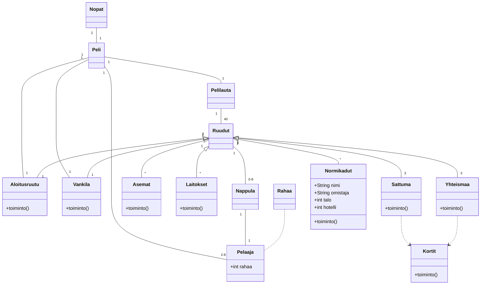

```mermaid
classDiagram
  
  Peli "1" -- "1" Pelilauta
  Peli "1" -- "2-8" Pelaaja
  Pelaaja : +int rahaa
  Nopat "2" -- "1" Peli
  Peli "1" -- "1" Aloitusruutu
  Peli "1" -- "1" Vankila
  Pelilauta "1" -- "40" Ruudut
  Ruudut "1" -- "0-8" Nappula
  Ruudut "1" <|-- "1" Aloitusruutu
  Aloitusruutu : +toiminto()
  Ruudut "1" <|-- "1" Vankila
  Vankila : +toiminto()
  Ruudut "1" <|-- "*" Asemat
  Asemat : +toiminto()
  Ruudut "1" <|-- "*" Laitokset
  Laitokset : +toiminto()
  Ruudut "1" <|-- "3" Sattuma
  Sattuma : +toiminto()
  Sattuma  ..> Kortit
  Kortit : +toiminto()
  Ruudut "1" <|-- "3" Yhteismaa
  Yhteismaa : +toiminto()
  Yhteismaa  ..> Kortit
  Ruudut "1" <|-- "*" Normikadut
  Normikadut : +String nimi
  Normikadut : +String omistaja
  Normikadut : +int talo
  Normikadut : +int hotelli
  Normikadut : +toiminto()
  Nappula "1" -- "1" Pelaaja
  Rahaa .. Pelaaja
  
```  
