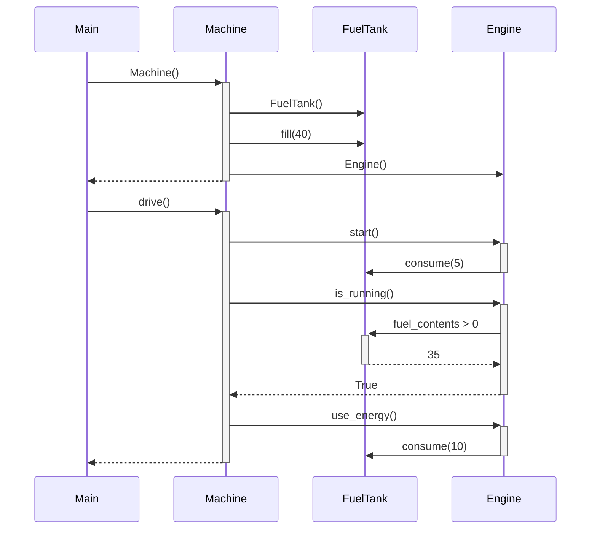

```mermaid
sequenceDiagram
  participant Main
  participant Machine
  participant FuelTank
  participant Engine
  Main ->> +Machine: Machine()
  Machine ->> FuelTank: FuelTank()
  Machine ->> FuelTank: fill(40)
  Machine ->> Engine: Engine()
  Machine -->> -Main:  
  Main ->> +Machine: drive()
  Machine ->>+Engine: start()
  Engine ->>-FuelTank: consume(5)
  Machine ->> +Engine: is_running()
  Engine ->> +FuelTank: fuel_contents > 0
  FuelTank -->>-Engine: 35
  Engine -->>-Machine: True
  Machine ->> +Engine: use_energy()
  Engine ->> -FuelTank: consume(10)
  Machine -->> - Main:     

```
  
