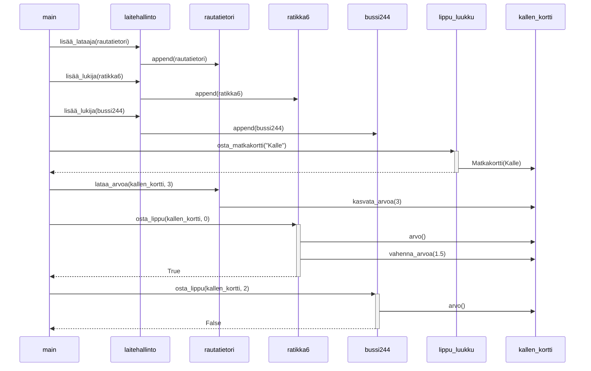

```mermaid
sequenceDiagram
  participant main
  participant laitehallinto
  participant rautatietori
  participant ratikka6
  participant bussi244
  participant lippu_luukku
  participant kallen_kortti
  main ->> laitehallinto: lisää_lataaja(rautatietori)
  laitehallinto ->> rautatietori: append(rautatietori)
  main ->> laitehallinto: lisää_lukija(ratikka6)
  laitehallinto ->> ratikka6: append(ratikka6)
  main ->> laitehallinto: lisää_lukija(bussi244)
  laitehallinto ->> bussi244: append(bussi244)
  main ->> +lippu_luukku: osta_matkakortti("Kalle")
  lippu_luukku ->> kallen_kortti: Matkakortti(Kalle)
  lippu_luukku -->> -main:  
  main ->> rautatietori: lataa_arvoa(kallen_kortti, 3)
  rautatietori ->> kallen_kortti: kasvata_arvoa(3)
  main ->> +ratikka6: osta_lippu(kallen_kortti, 0)
  ratikka6 ->> kallen_kortti: arvo()
  ratikka6 ->> kallen_kortti: vahenna_arvoa(1.5)
  ratikka6 -->> -main: True
  main ->> +bussi244: osta_lippu(kallen_kortti, 2)
  bussi244 ->> kallen_kortti: arvo()
  bussi244 -->> -main: False
``` 
 
 
